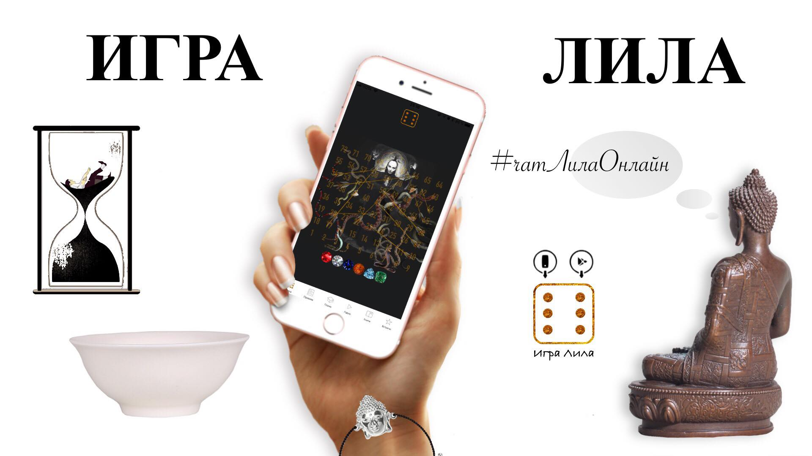

  <h1 align="center">Игра Лила</h1> 

---
   Игра Лила или Лила Чакра открывает игрокам Вселенную через самопознание и исследование природы своего ума.

   Трансформационная, психологическая и божественная игра передававшаяся по семьям браминов от отца к сыну, на протяжении более 5500 лет.

   В своей жизни, по мере эволюции ума, вначале мы пытаемся изменить правила мира и законы Вселенной под себя, но с течением времени мы понимаем, что гораздо проще и правильней понять существующие правила игры и стать искусным игроком.

   Лила Чакра, как мудрая мать, заботливо передает нам концентрированный экстракт священных писаний индуизма в игровой и понятной форме.
   

Понять правила игры легче с теми кто играет в нее не один год. 

  <h2 align="center"><a href="https://m.me/leelachakraapp">Запись в чат игры</a></h2> 
  

